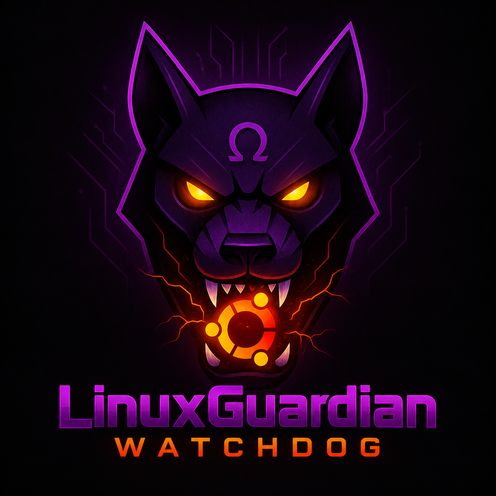

<p align="center"></p>

# LinuxGuardian Watchdog

A free, integrated security platform for Linux desktops — a native port of
[MacGuardianWatchdog](https://github.com/abelxmendoza/MacGuardianWatchdog),
rebuilt for the Linux desktop instead of macOS.

Same idea as the original: real security tools (not just a UI) in one place —
antivirus scanning, rootkit detection, file integrity monitoring, a process
killer, a cache cleaner, one-click software updates, security posture auditing, and automated
remediation — orchestrated by a native desktop app, with all data kept local
to the machine. The GUI also carries over the original's dark "Omega
Black-Ops" theme (purple/red/yellow accents on near-black).

> **Status: scaffold / early bootstrap.** This is the initial skeleton —
> directory layout, a working core script or two, and a minimal native UI
> shell. It is not yet feature-complete. See [docs/ROADMAP.md](docs/ROADMAP.md).

## Architecture

Same hybrid split as the macOS original: a native GUI frontend that shells
out to security scripts which do the real work, so the heavy lifting stays
inspectable, scriptable, and usable from a terminal even without the GUI.

| Layer | macOS original | Linux port |
|---|---|---|
| GUI toolkit | SwiftUI (native macOS) | GTK4 + libadwaita (native GNOME/Linux desktop), Python |
| Scan engine | ClamAV + rkhunter | ClamAV + rkhunter (same tools, native on Linux) |
| Scheduling | `launchd` | `systemd` user timers |
| Service management | `launchctl` | `systemctl --user` |
| File integrity | SHA-256 baseline (bash) | SHA-256 baseline (bash, ported as-is — fully portable) |
| Local data dir | `~/.macguardian/` | `~/.linuxguardian/` |
| Firewall checks | macOS Application Firewall | `ufw` / `firewalld` (auto-detected) |
| Behavioral / ML layer | Python (`ai_engine.py`, `ml_engine.py`) | Python, ported later (see roadmap) |

## Repository layout

```
LinuxGuardianWatchdog/
├── images/                   # Logo (full) and app icon
├── LinuxGuardianSuite/       # Shell + Python scripts that do the actual work
│   ├── config.sh             # Shared paths, colors, defaults
│   ├── utils.sh              # Shared logging/helper functions
│   ├── linux_guardian.sh     # ClamAV + rkhunter scan orchestration
│   ├── linux_watchdog.sh     # SHA-256 file integrity baseline + honeypot
│   ├── linux_security_audit.sh  # Scored security posture checks
│   ├── linux_process_manager.sh # Process killer: list, SIGTERM/SIGKILL by PID or name
│   ├── linux_cache_cleanup.sh   # Cache cleaner: browser + system caches, dry-run by default
│   ├── linux_updates.sh         # Updates: check + install apt/snap updates (password via polkit)
│   ├── update_inventory.py      # Read-only inventory of pending updates (security/system/third-party/snap)
│   ├── linux_exposure.sh        # Network exposure: what's listening and who can reach it (detection only)
│   ├── exposure_inventory.py    # The detector behind it (ss + interfaces + firewall state, no root)
│   ├── scanner_health.py        # Read-only: definitions age, updater state, rootkit baseline
│   ├── events.py                # Shared security-event format written to ~/.linuxguardian/incidents/
│   ├── install_scheduler.sh  # Installs systemd user timers for automation
│   └── modules.conf.example
├── LinuxGuardianSuiteUI/     # Native GTK4 / libadwaita desktop app (Python)
│   └── linuxguardian_ui/
├── docs/                     # Architecture notes and roadmap
└── tests/                    # Script sanity tests
```

## Requirements

- A Linux desktop (tested target: GNOME / any GTK4+libadwaten-capable DE)
- `clamav` (`clamscan`, `freshclam`) and `rkhunter` — install via your
  distro's package manager, e.g. `sudo apt install clamav rkhunter`
- Python 3.10+ with PyGObject (`python3-gi`) and `libadwaita-1` for the GUI
- `systemd` (user services) for scheduled scans

## Getting started (scripts only, no GUI yet)

```bash
cd LinuxGuardianSuite
./linux_watchdog.sh --init                 # create the file-integrity baseline
./linux_guardian.sh --scan                 # run a ClamAV + rkhunter scan
./linux_security_audit.sh                  # scored security posture check
./linux_process_manager.sh --list          # process killer: list processes
./linux_process_manager.sh --kill PID      # ...or --kill-name NAME [--force]
./linux_cache_cleanup.sh --scan            # cache cleaner: preview reclaimable space
./linux_cache_cleanup.sh --clean --apply   # ...actually clear it
./linux_updates.sh --check                 # updates: what's pending (no root needed)
./linux_updates.sh --apply --dry-run       # ...preview an install; changes nothing
./linux_updates.sh --apply                 # ...install all (password prompt via polkit)
./linux_updates.sh --apply --security-only # ...or just the security fixes
./linux_updates.sh --hold ros2             # freeze a stack (ros2 | gazebo | nvidia) so nothing updates it
./linux_updates.sh --unhold ros2           # ...and let it update again
./linux_guardian.sh --health               # can you trust a scan right now? (definitions age, rootkit baseline)
./linux_guardian.sh --update               # update virus definitions (password via polkit)
./linux_guardian.sh --enable-auto-update   # turn on ClamAV's background updater (asks first, password via polkit)
./linux_guardian.sh --scan --rootkit       # scan + rkhunter as root (password via polkit; without it the rootkit check is skipped and says so)
./linux_exposure.sh --check                # what's listening, who can reach it (read-only, no root)
./linux_exposure.sh --record               # ...and log an event for each NEW exposure
```

## Getting started (GUI)

```bash
cd LinuxGuardianSuiteUI
python3 -m pip install -r requirements.txt   # or use your distro's PyGObject package
python3 -m linuxguardian_ui.main
```

### Desktop / dock integration

To launch it like a normal installed app — from the app menu, a Desktop
icon, and pinned to the dock (GNOME; other desktops get the app menu entry
and Desktop icon, pin to the dock manually):

```bash
cd LinuxGuardianSuiteUI
./install_desktop_entry.sh --install
```

Run `./install_desktop_entry.sh --uninstall` to remove it again.

## License

MIT — see [LICENSE](LICENSE). Bundles/relies on ClamAV (GPL-2.0) and
rkhunter (GPL-2.0) as external tools, same as the macOS original.

**Disclaimer**: review the code before running it, test in a non-production
environment first, keep backups, prefer dry-run/preview modes, and manually
review anything before it's quarantined or deleted. Misuse can cause data
loss.
